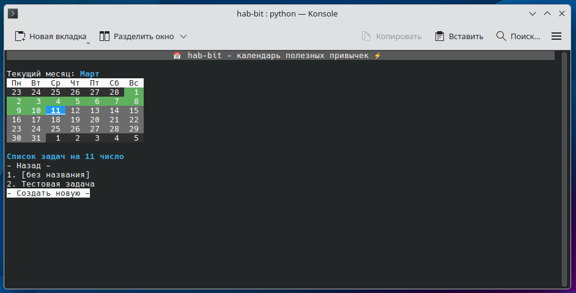

# 📅 hab-bit - календарь полезных привычек⚡️


## Описание
hab-bit - консольный календарь полезных привычек с TUI-интерфейсом.
Программа является усовершенствованной версией моей предыдущей программы [TaskTracker](https://github.com/d1-boy4h/task-tracker).
Интерфейс построен с использованием фреймворка [Rich](https://github.com/Textualize/rich).

## Возможности
Программа предоставляет календарь текущего месяца, к каждому дню которого привязаны задачи (привычки), которые пользователь может сам себе назначать и самостоятельно следить за ходом их выполнения: если за прошедший день все поставленные задачи были выполнены, то день помечается зелёным, в противном случае - красным.

## Установка и запуск
```sh
$ git clone https://github.com/d1-boy4h/hab-bit.git
$ cd hab-bit
$ chmod u+x main.py
$ python -m venv .venv
$ source .venv/bin/activate
$ pip install -r requirements.txt
$ ./main.py
```

## Улучшения в будущем
- [ ] Система логгирования
- [ ] Универсальный компонент меню
- [ ] Необязательная к выполнению задача
- [ ] Возможность выполнять задачи за прошедшие дни (с пометкой)
- [ ] Оптимизация фетчей
- [ ] Отработка исключений при работе с json
